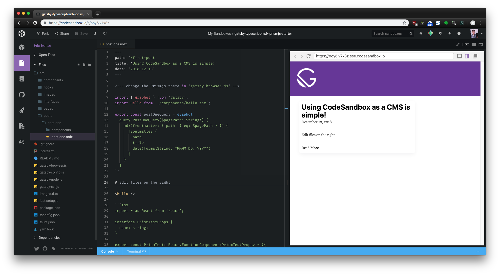

GatsbyJS has been exploding over the static JS scene over the last few months. Developers everywhere are embracing Gatsby for it's ability to simplify static content generation, as well as it's content and asset aggregation through GraphQL. They make it much easier to spin up a new project and build blazing fast static React apps. It's become my go-to when working with any static site, such as landing pages or blogs, where content isn't very dynamic and benefits from preprocessing.

As great as GatsbyJS is, it can take a while to start your first project. You have to download and install their CLI, bootstrap a new project with `npx`, or clone a starter project repo. Then you can spin up the local dev environment. It's not a lot, but it is a commitment, particularly when you're introducing it to someone new. You want results, and fast.

## Blazing fast sites -- in a blast 💣🔥

What if you could just click a link, wait for dependencies to download and compile, and **blam** -- [you've got yourself a Gatsby blog?](http://codesandbox.io/s/github/gatsbyjs/gatsby-starter-blog) This is the kind of world we live in thanks to platforms like [CodeSandbox](http://codesandbox.io).

But this got me thinking, why not **use CodeSandbox as a kind of CMS** for your blog? Since it works off Github, and can commit code/pull requests, you're capable of editing and authoring any content you'd like. Just open up the Sandbox, create a new file, make a pull request, and you're done! *(depending on your build process)*

## How it works ⚙️

CodeSandbox added server-side platforms like Gatsby, Node, and Apollo a few months ago. This allows anyone to spin up *(any?)* Gatsby project in **your browser**. If you don't already have a Gatsby blog, there's no excuse now.

**Only requirements?**

* Github account
* CodeSandbox account (uses Sign-in with Github)

**Here's how it roughly works:**

* Pick [a Gatsby starter template](https://www.gatsbyjs.org/starters/) that pulls content locally (like text, markdown, MDX, etc)
* [Open on CodeSandbox](https://codesandbox.io/s/github/tylergreulich/gatsby-typescript-mdx-prismjs-starter). *You can open any Github repo by using the format `codesandbox.io/s/githubuser/reponame/`*
* Create a new page or content file (like MDX). In Gatsby, any React component in the `/src/pages/` directory will be a page. For content sites (like Markdown), try finding an example .MD post to copy.
* Fork sandbox (click button on top or happens automatically when you save changes).
* Save new repo to Github. Click the Github icon on the left side, sign in using Github, and save the repo there.
* Save any changes and commit code (if not already)
* Merge pull request on Github
* Use a service like Netlify to build your code. 

*You could build Gatsby locally on your machine, but this tutorial assumes you're trying to achieve everything in the cloud.*

> You could also use Netlify CMS once you're using Netlify. However, you don't get the same benefits of the "local dev environment" that CodeSandbox emulates, like a live preview, editing React components, or Gatsby configs.

### Deploying with Netlify 🚀

1. [Sign up for a Netlify account](https://app.netlify.com/signup)
1. [Create a new site from Git](https://app.netlify.com/start)

Netlify should automatically detect Gatsby and run the appropriate build script. If not (or if you have a custom/pre-build script), you can change it in the Netlify deploy settings.

### Caveats 🐛

The only *tiny* bug I've encountered involves using MDX with Gatsby (ironically the starter I chose to feature as well). When you save an MDX file, the changes don't immediately propogate in the live preview. 

The way MDX works is by compiling static assets like JS files for all the JSX components you import, then Gatsby displays those. Every time you save, new static assets are generated for any changed MDX file (instead of using hot module reloading like most CLIs). 

This gets a little clunky in CodeSandbox, and sometimes you won't see changes immediately (requring a refresh of the live preview window).

## Why stop at blogs? 👨‍💻

If you need to whip out a fast static website completely in the cloud, this is your solution. This streamlines the design sprint: allowing you to jump directly into code that easily shareable with collaborators, synced with Git, and effortlessly iterable through forks. Whether you're working on a **[landing page](https://www.gatsbyjs.org/starters/gillkyle/gatsby-starter-landing-page/)** or a **[deck for your next conf talk](https://www.gatsbyjs.org/starters/fabe/gatsby-starter-deck/)**, Gatsby has plenty of starters to get you hacking away even faster 👍 And combined with services like [Netlify](http://netlify.com) that deploy from Git repositories, your workflow can't get any faster *(or secure!)*.

And if you haven't already explored [CodeSandbox](http://codesandbox.io), I highly suggest checking it out. It's a really useful tool not only for coding from scratch, but also pulling up any git branch, which makes it fantastic for creating examples or reviewing PRs live. Also deploys to [Zeit's Now](https://zeit.co/now) if you're into that ▲ 🌚

Hope this helps!
Ryo

***

**References:**

* [CodeSandbox](http://codesandbox.io)
* [GatsbyJS](http://gatsbyjs.org)
* [GatsbyJS Starters](https://www.gatsbyjs.org/starters/)
* [Gatsby Starter - MDX + PrismJS + Styled Components + TS](https://codesandbox.io/s/github/tylergreulich/gatsby-typescript-mdx-prismjs-starter)
* [Deploying GatsbyJS to Github Pages](https://www.gatsbyjs.org/docs/how-gatsby-works-with-github-pages/)
* [Netlify](http://netlify.com)