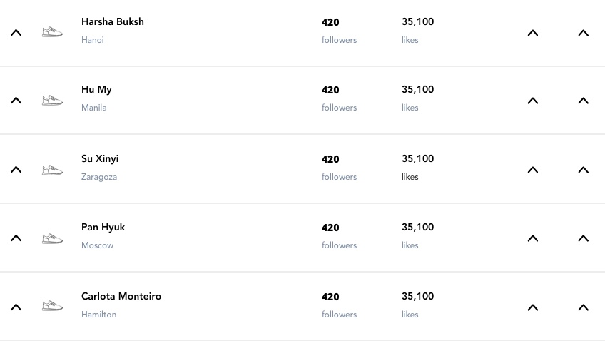
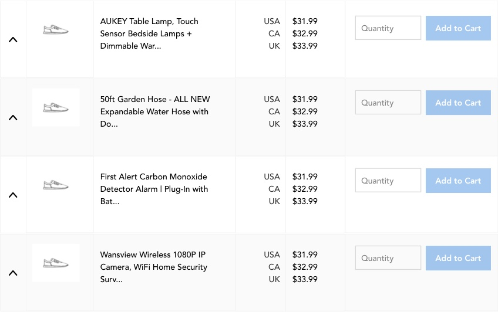

Tables - they comprise a multitude of different interfaces we consume on a regular basis. Spreadsheets, CRMs, settings pages -- we see tables everywhere in our UI and it's inevitable as a designer that you'll have to mock one up (without completely copping out with a screenshot of Excel/HTML).

I had to design a table for a client in Sketch, so I did a quick search for dynamic Sketch table symbols/components, and I couldn't track anything down that was _actually_ dynamic. Most tables were "hard coded" in a sense, with their columns and rows defined by line shapes, instead of individual cells, making it impossible to change the table format beyond the template.

So I set off and created my own dynamic Sketch table and decided to share it with everyone (because tables are hard enough right? 😅😵)

## How to use 🛠

[**Download the Sketch template here**](https://github.com/whoisryosuke/ryosuke-gatsby-blog/tree/master/src/content/blog/2019/sketch-table-components/Dynamic-Sketch-Tables.zip)

1.  Insert desired cell symbols and align horizontally into a table row.
2.  Group the table row (to make it easier to work with).
3.  Copy and paste the row, then align underneath. Repeat until desired row count is reached.
4.  CMD/CTRL + Click each cell and change the data dynamically in the sidebar (like text or even icons!)
5.  Resize to your ❤️'s desire 👌

## The limitations / caveats 🚦

### Complex text styles 🖍

If you'd like a cell where a portion of the text is bold or colored differently than the defined text style, you'll have to detach it from the symbol. Sketch simply can't handle nested text styles yet in that capacity.

### Alternating table rows⚪️⚫️

You could add a nested symbol for alternating table rows, but it becomes cumbersome to delete a row, and have to go into each cell/row and swap the background style. I've found it's easier to separate the alternating background behind the table row group, and you can delete rows and move them up without fussing with backgrounds.

## Table tennis for days 🏓

I hope this helps you design some tables in the future and expedite the already painful process of data-based design. If you have any questions feel free to hit me up on Twitter or comment here. And let me know if you 👀 any glitches 👾

Cheers,
Ryo
